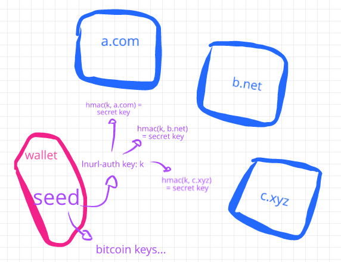
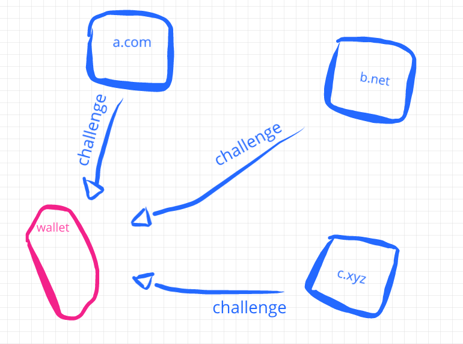
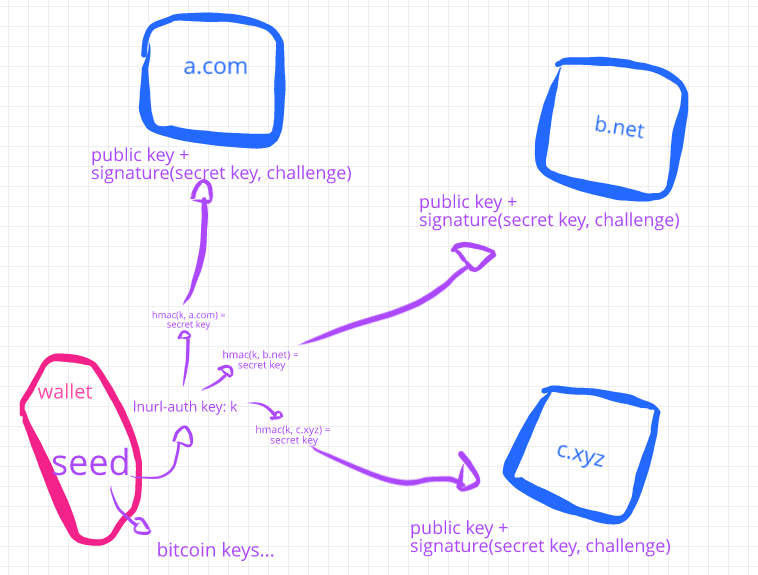

# lnurl-auth explained

You may have seen the [lnurl-auth](https://github.com/btcontract/lnurl-rfc/blob/master/lnurl-auth.md) spec or heard about it, but might not know how it works or what is its relationship with other [lnurl](https://github.com/fiatjaf/awesome-lnurl) protocols. This document attempts to solve that.

## Relationship between lnurl-auth and other lnurl protocols

First, **what is the relationship of lnurl-auth with other lnurl protocols?** The answer is none, except the fact that they all share the lnurl format for specifying `https` URLs.

In fact, lnurl-auth is very unique in the sense that it doesn't even need a Lightning wallet to work, it is a standalone authentication protocol that can work anywhere.

## How does it work

Now, **how does it work?** The basic idea is that each wallet has a seed, which is a random value (you may think of the BIP39 seed words, for example). Usually from that seed different keys are derived, each of these yielding a Bitcoin address, and also from that same seed may come the keys used to generate and manage Lightning channels.

What lnurl-auth does is to generate a new key from that seed, and from that a new key for each service (identified by its domain) you try to authenticate with.

That way, you effectively have a new identity for each website. Two different services cannot associate your identities.

**The flow goes like this:** When you visit a website, the website presents you with a QR code containing a _callback URL_ and a _challenge_. The challenge should be a random value.

When your wallet scans or opens that QR code it uses the _domain_ in the callback URL plus the _main lnurl-auth key_ to derive a key specific for that website, uses that key to sign the challenge and then sends both the public key specific for that for that website plus the signed challenge to the specified URL.

When the service receives the public key it checks it against the challenge signature and start a session for that user. The user is then **identified only by its public key**. If the service wants it can, of course, request more details from the user, associate it with an internal id or username, it is free to do anything. lnurl-auth's goals end here: no passwords, maximum possible privacy.

# FAQ

  * What is the advantage of tying this to Bitcoin and Lightning?

    One big advantage is that your wallet is already keeping track of one seed, it is already a precious thing. If you had to keep track of a separate auth seed it would be arguably worse, more difficult to bootstrap the protocol, and arguably one of the reasons similar protocols, past and present, weren't successful.

  * Just signing in to websites? What else is this good for?

    No, it can be used for authenticating to installable apps and physical places, as long as there is a service running an HTTP server somewhere to read the signature sent from the wallet. But yes, signing in to websites is the main problem to solve here.

  * Phishing attack! Can a malicious website proxy the QR from a third website and show it to the user to it will steal the signature and be able to login on the third website?

    No, because the wallet will only talk to the the callback URL, and it will either be controlled by the third website, so the malicious won't see anything; or it will have a different domain, so the wallet will derive a different key and frustrate the malicious website's plan.

  * I heard [SQRL](https://sqrl.grc.com/) had that same idea and it went nowhere.

    Indeed. SQRL in its first version was basically the same thing as lnurl-auth, with one big difference: it was vulnerable to phishing attacks (see above). That was basically the only criticism it got everywhere, so the protocol creators decided to solve that by introducing complexity to the protocol. While they were at it they decided to add more complexity for managing accounts and so many more crap that in the the spec which initially was a single page ended up becoming 136 pages of highly technical gibberish. Then all the initial network effect it had, libraries and apps were trashed and nowadays no one can do anything with it (but, [see](https://sqrl.grc.com/threads/developer-documentation-conflicted-and-confusing-please-help-clarify.951/), there are still people who love the protocol writing in a 90's forum with no clue of anything besides their own Java).

  * We don't need this, we need WebAuthn!

    [WebAuthn](https://webauthn.guide/) is essentially the same thing as lnurl-auth, but instead of being simple it is complex, instead of being open and decentralized it is centralized in big corporations, and instead of relying on a key generated by your own device it requires an expensive hardware HSM you must buy and trust the manufacturer. If you like WebAuthn and you like Bitcoin you should like lnurl-auth much more.

  * What about [BitID](https://github.com/bitid/bitid)?

    This is another one that is [very similar](https://www.youtube.com/watch?v=3eepEWTnRTc) to lnurl-auth, but without the anti-phishing prevention and extra privacy given by making one different key for each service.

  * What about LSAT?

    It doesn't compete with lnurl-auth. LSAT, as far as I understand it, is for when you're buying individual resources from a server, not authenticating as a user. Of course, LSAT can be repurposed as a general authentication tool, but then it will lack features that lnurl-auth has, like the property of having keys generated independently by the user from a common seed and a standard way of passing authentication info from one medium to another (like signing in to a website at the desktop from the mobile phone, for example).
